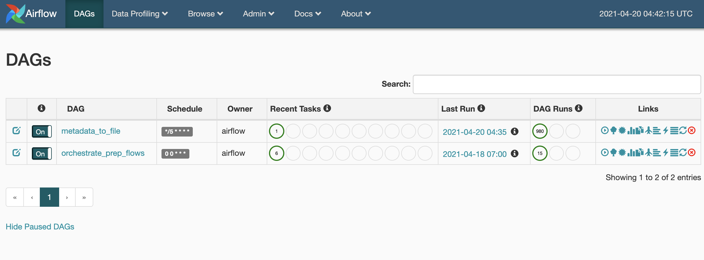
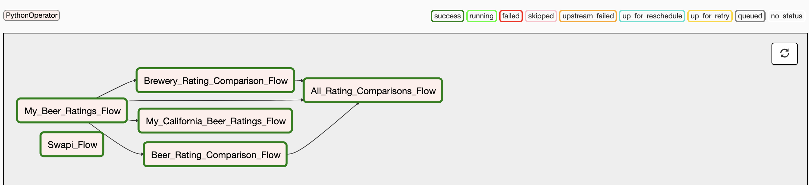

# tableau-prep-orchestrator

## Summary

Tableau Prep Orchestrator is an opinionated docker deployment of [Apache Airflow](https://airflow.apache.org/docs/apache-airflow/stable/) that has been preconfigured to work with Tableau Server/Online and acts as an open-source alternative to Tableau Prep Conductor. It combines Airflow with Tableau's [Metadata](https://help.tableau.com/current/api/metadata_api/en-us/index.html) and [REST](https://help.tableau.com/current/api/rest_api/en-us/REST/rest_api.htm) APIs to create a standalone server for scheduling, running, and managing dependencies around [Tableau Prep](https://www.tableau.com/products/prep) Flows published to [Tableau Server](https://www.tableau.com/products/server). After filling out a short .yml file with your Tableau Server login info and spinning up this [Docker](https://www.docker.com/) container (setup instructions below), your Prep Flows are automatically profiled and an Airflow DAG is generated with all dependencies and order of operations handled for you. Any changes made are automatically added at a configurable interval (every 5 min by default) and will integrate into your existing DAG with no manual intervention required.

## Setup

### Setup Docker

Before you can use Tableau Prep Orchestrator, you will need to install Docker.

- Install Docker
  - <https://docs.docker.com/get-docker/>

### Clone the GitHub Project

- Clone this repo onto your local machine
- Fill out tableau-config.yml file with your Tableau Server/Online connection info. If you only want to orchestrate Tableau Prep Flows in certain projects, fill out the *projects-to-refresh-from* section with a list of projects. Otherwise, leave empty and all Flows on the site will be pulled in for orchestration.

```yaml
--- # Tableau Server API Info
  tableau-base-url: "https://10ax.online.tableau.com"
  tableau-site: "my-tableau-site"
  tableau-username: "email@example.com"
  tableau-password: "super-secret-password"
  # leave blank to gather flows from all projects
  projects-to-refresh-from:
    - "default"
```

### Build & Deploy with Docker

Open terminal or cmd and navigate to the directory where you cloned the GitHub Repo then run the commands below that correspond to the setup you would like.

- Build your docker image
  - `docker build -t airflow . --no-cache`

- Run with docker run (Sequential Executor)
  - `docker run -d -p 8080:8080 airflow tableau-prep-orchestrator`

- run with docker-compose (Local Executor)
  - `docker compose -f docker-compose-LocalExecutor.yml up -d`

### Check It Out

Open a browser window and navigate to <http://localhost:8080> to start using Tableau Prep Orchestrator

Toggle the DAG to "On" and wait a few seconds for it to run. This gather the Flows metadata from Tableau and use it to create the orchestration DAG. Refresh your browser and see the newly created "orchestrate_prep_flows" DAG. Toggle it to "On" as well and click the linked DAG name to navigate to the graph view.



In the DAG graph view, press the refresh button in the top-right corner periodically to watch Airflow run each Flow on Tableau and monitor its timing and progress.



You can view a short video of the process here: <https://vimeo.com/546802329>

## Customizations

One of the bigget benefits to Tableau Prep Orchestrator is it's also a full intance of Airflow with limitless was to customize and extend its functionality.

- Edit each DAG to change timezone, scheduled execution times, and how to handle task failures.
- Edit the Airflow config and dockerfiles to customize the implementations of Airflow and how it is deployed.
- Add new DAGs or alter current ones to add any other workflows to run in tandem to Prep Flows. This can be used to manage backups or automate permissions and licensing on your Tableau Server. Everything is preinstalled and templated to further automate and extend your Tableau environment as more needs arise.

## Productionize
- By default, Tableau Prep Orchestrator does not use authenticaion. To run in production, you would want to modify the airflow.cfg file to enable your desired authentication method.
- docker compose on a single machine is great for Development and Test environments where containers can be quickly spun up and linked. However, to make better use of the horizontal scalability and fault tolerance of Airflow and Docker, deploy with Docker Swarm or Kubernetes.

## Acknowledgments

The Apache Airflow portion of this project is based on:
<https://github.com/puckel/docker-airflow>
